# ProxUI

A modern web-based management interface for Proxmox VE with multi-cluster support and focus on desktop and mobile experience.

## Features

ProxUI isn't a replacement for Proxmox web interface, but a light-weight addition to represent available information in more user friendy way as well as filling some gaps. It has essential functionality to manage single instance(s) or cluster(s).

### Virtual Machine Management
- Represents VM and container status and performance metrics in more readable way
- Creation VMs and containers from templates
- **Cloud VM Templates**: Create VM templates from popular cloud images (Ubuntu, Debian, Rocky, Alma, Fedora) with cloud-init support
- Built-in configuration editor
- QEMU Guest Agent integration for disk usage monitoring
- Consolidated configuration single-page view incluing cloud-init params (like ssh keys)
- Background job queue for long-running operations with real-time progress tracking

### Storage Management
- Unified storage view across all cluster nodes
- Group shared media
- Real-time storage usage monitoring

### System Monitoring
- Dashboard with cluster overview and statistics
- Task monitoring
- Network configuration viewing
- Real-time basic resource usage charts

### Multi-Cluster Management
- Connect and manage multiple Proxmox clusters or individual servers from a single interface
- Easy cluster switching with persistent user preferences
- Cluster connection management and status monitoring

### User Experience
- Focus on desktop and mobile devices

## Screenshots

### Desktop
<div style="display: flex; gap: 10px;">
  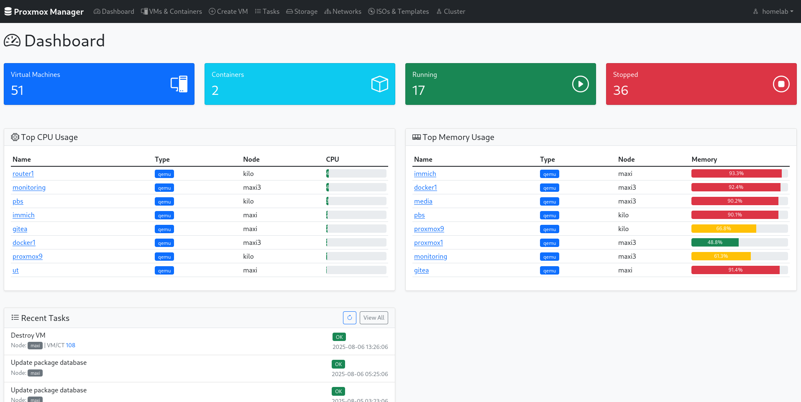
  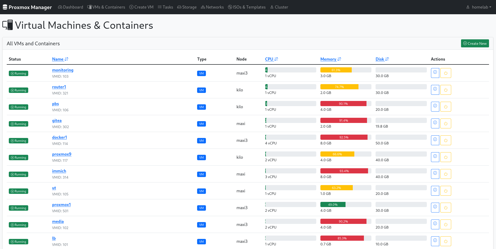
  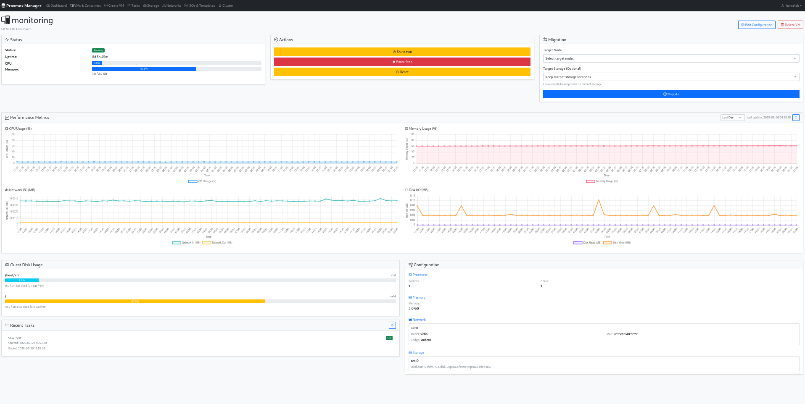
  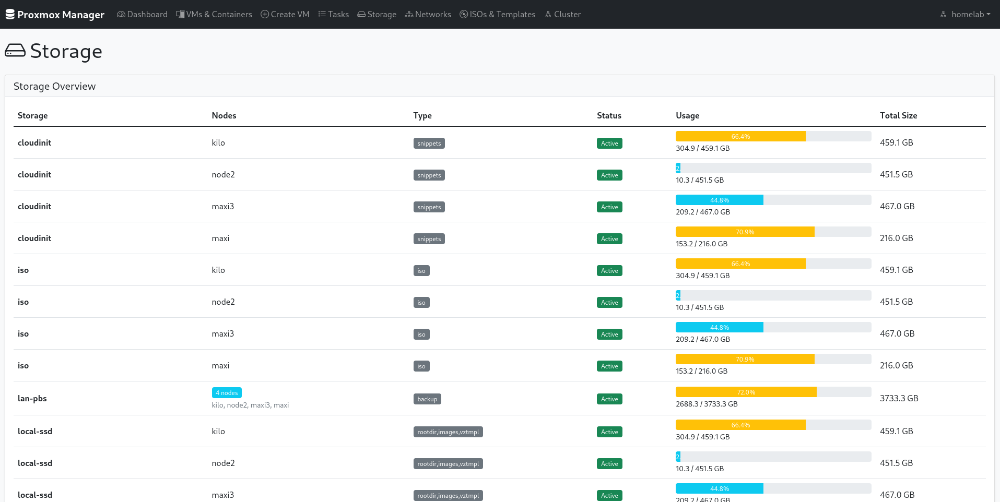
  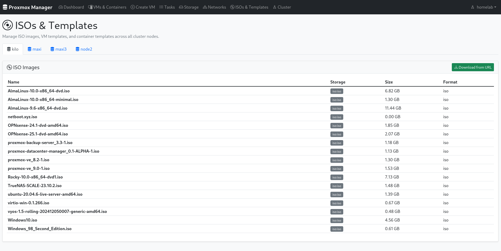
  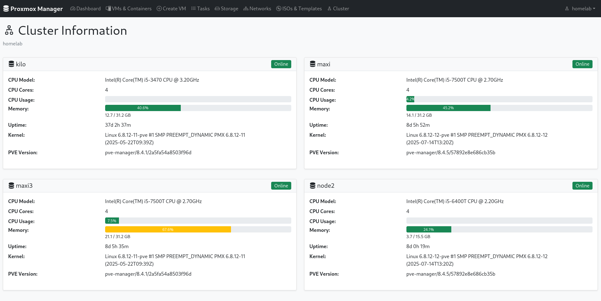
  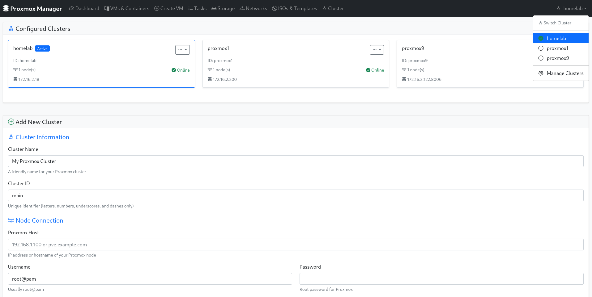
  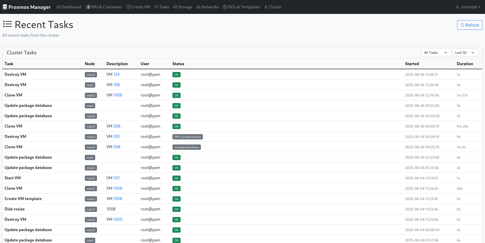
</div>

### Mobile
<div style="display: flex; gap: 10px;">
  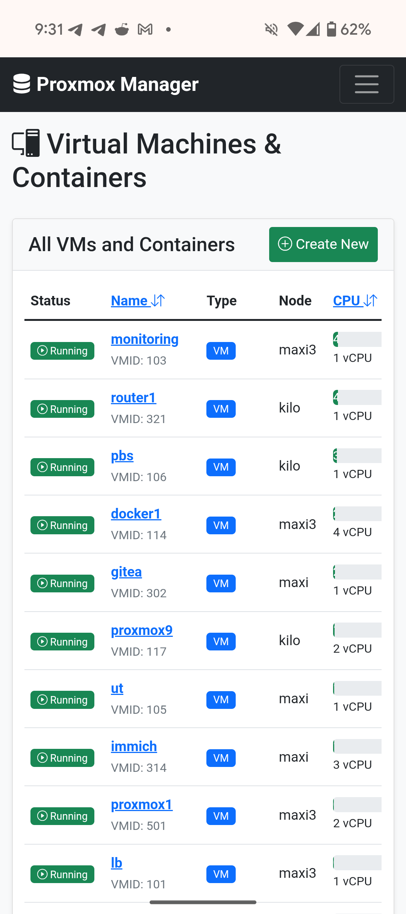
  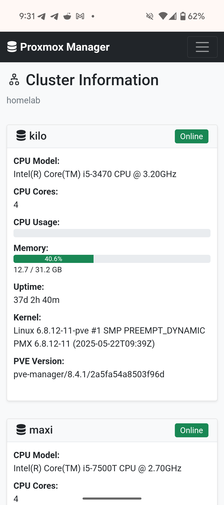
  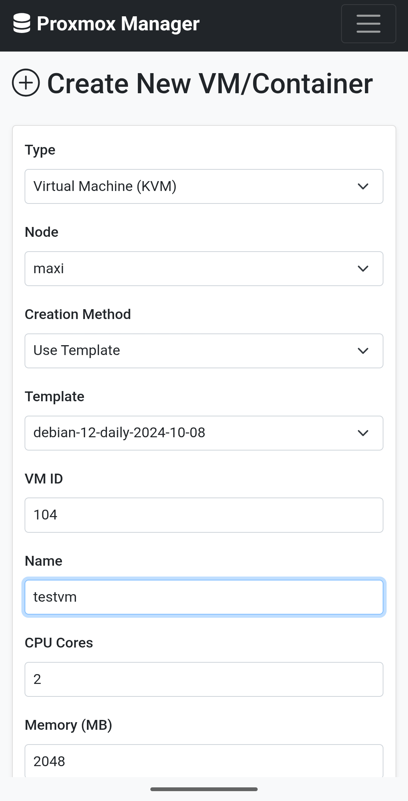
  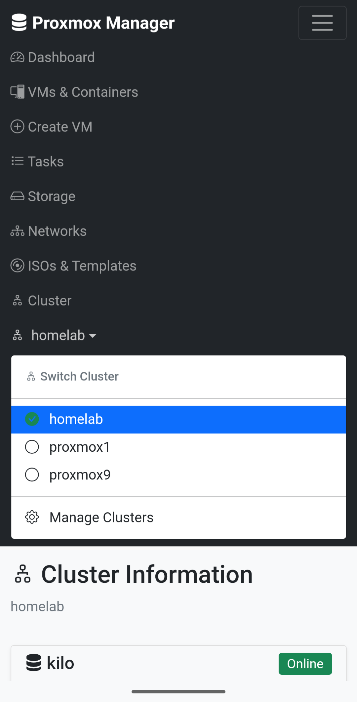
</div>

## Quick Start

### Using Docker Compose (Recommended)

1. Clone the repository:
```bash
git clone https://github.com/greenlogles/proxui
cd proxui
```

2. Start the application:
```bash
docker-compose up -d
```

3. Access the web interface at `http://localhost:8080`

4. Configure your first Proxmox cluster through the connect page

### Manual Installation

1. Install dependencies:
```bash
pip install -r requirements.txt
```

2. Run the application:
```bash
python app.py
```

3. Access the web interface at `http://localhost:8080`

## Configuration

The application stores configuration in `/app/data/config.toml` (or `./data/config.toml` in development). The configuration file supports multiple clusters:

```toml
# Password authentication
[[clusters]]
id = "homelab"
name = "Home Lab"
[[clusters.nodes]]
host = "192.168.1.100:8006"
user = "root@pam"
password = "your-password"
verify_ssl = false

# API Token authentication (recommended for production)
[[clusters]]
id = "production"
name = "Production Cluster"
[[clusters.nodes]]
host = "pve.example.com"
user = "root@pam"
token_name = "proxui"
token_value = "xxxxxxxx-xxxx-xxxx-xxxx-xxxxxxxxxxxx"
verify_ssl = true
```

### Authentication Methods

ProxUI supports two authentication methods:

1. **Password Authentication**: Traditional username/password login. Simple but less secure for production.

2. **API Token Authentication** (Recommended): Uses Proxmox API tokens for authentication. To create a token:
   - Go to Datacenter → Permissions → API Tokens in Proxmox
   - Click "Add" and select a user (e.g., `root@pam`)
   - Enter a token ID (e.g., `proxui`)
   - Optionally uncheck "Privilege Separation" for full user permissions
   - Copy the token secret (shown only once!)

Configuration file can be managed manually or through the web UI (Cluster Management page).

### Environment Variables

| Variable | Description | Default |
|----------|-------------|---------|
| `CONFIG_FILE_PATH` | Path to the main configuration file | `./data/config.toml` |
| `CLOUD_IMAGES_PATH` | Path to custom cloud images JSON file | `./cloud_images.json` |

### Custom Cloud Images

ProxUI includes a default list of popular cloud images (Ubuntu, Debian, Rocky Linux, AlmaLinux, Fedora). You can customize this list by:

1. Create your own `cloud_images.json` file:
```json
{
    "my-custom-image": {
        "name": "My Custom Linux",
        "url": "https://example.com/my-image.qcow2",
        "os_type": "l26",
        "description": "My custom cloud image"
    }
}
```

2. Mount it and set the environment variable:
```bash
docker run -d \
  -e CLOUD_IMAGES_PATH=/config/my-images.json \
  -v ./my-images.json:/config/my-images.json \
  ghcr.io/greenlogles/proxui:latest
```

## Custom User creation

If you are willing to use ProxUI with read-only user, create new one by running next command on one of the ProxMox servers:

```sh
# Create new user
pveum user add proxui-readonly@pve --password yourpassword --comment "ProxUI read-only user"

# Assign built-in PVEAuditor role to root path with propagation
pveum acl modify / --users proxui-readonly@pve --roles PVEAuditor --propagate 1
```

## Docker Deployment

The application is designed for Docker deployment with persistent volume mounting. Docker images are automatically built and published via CI/CD pipeline.

### Available Image Tags

- **`ghcr.io/greenlogles/proxui:latest`** - Latest stable release (recommended for production)
- **`ghcr.io/greenlogles/proxui:testing`** - Latest development build from main branch
- **`ghcr.io/greenlogles/proxui:v1.2.3`** - Specific version tags for releases

### Docker Compose (Recommended)

```yaml
version: '3.8'
services:
  proxui:
    image: ghcr.io/greenlogles/proxui:latest  # or :testing for latest development
    container_name: proxui
    ports:
      - "8080:8080"
    volumes:
      - ./data:/app/data
      # Optional: mount custom cloud images config
      # - ./my-cloud-images.json:/config/cloud-images.json
    environment:
      - CONFIG_FILE_PATH=/app/data/config.toml
      # Optional: use custom cloud images
      # - CLOUD_IMAGES_PATH=/config/cloud-images.json
    restart: unless-stopped
```

### Docker Run

```bash
# Latest stable release
docker run -d \
  --name proxui \
  -p 8080:8080 \
  -v ./data:/app/data \
  -e CONFIG_FILE_PATH=/app/data/config.toml \
  ghcr.io/greenlogles/proxui:latest

# Latest development build
docker run -d \
  --name proxui \
  -p 8080:8080 \
  -v ./data:/app/data \
  -e CONFIG_FILE_PATH=/app/data/config.toml \
  ghcr.io/greenlogles/proxui:testing
```

### CI/CD and Automated Builds

ProxUI uses GitHub Actions for automated testing and Docker image building with GitHub Container Registry:

- **Testing Images**: Built automatically on every push to `main` branch (`:testing` tag)
- **Release Images**: Built automatically when GitHub releases are created (`:latest` + version tags)
- **Multi-platform**: Images support both `linux/amd64` and `linux/arm64`
- **No Setup Required**: Uses built-in GitHub authentication and permissions

Images are published to GitHub Container Registry at `ghcr.io/greenlogles/proxui`.

## Requirements

- Python 3.7+
- Flask 2.3.3
- proxmoxer 2.0.1
- Access to Proxmox VE cluster(s)

## Security Notes

- Configuration files contain sensitive credentials
- Use strong passwords and consider API tokens instead of root passwords
- SSL certificate verification can be disabled for self-signed certificates
- Ensure proper network security when exposing the web interface

## Support

If you have any questions, need assistance, please open issue or discussion here on GitHub.

## Author(s)

Alex Shut @greenlogles (https://github.com/greenlogles/ProxUI)
